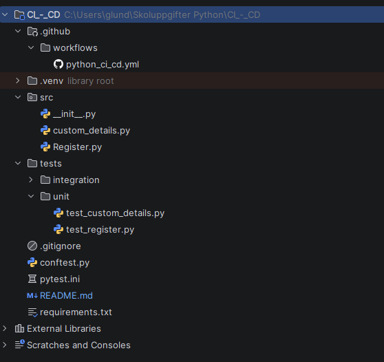
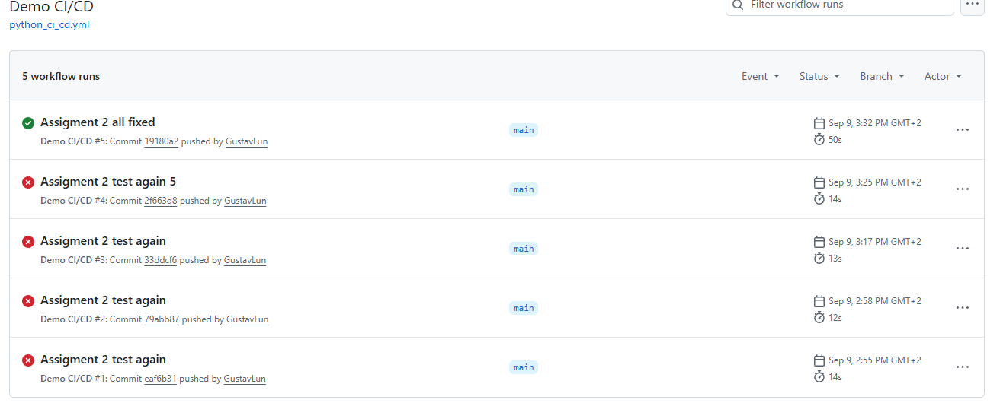
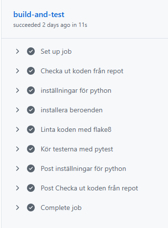

## 📋 Uppgifter

| # | Uppgift                                           | Beskrivning                                                      | Status |
|---|---------------------------------------------------|------------------------------------------------------------------|--------|
| 1 | [Diskutera tillsammans](#1-Diskutera-tillsammans) |              | 🟢 Klart |
| 2 | [Projekt](#2-Projekt)                             | | 🟢 Klart |
| 3 | Extra                                             |       | 🔴 Ej påbörjad |
### Status
- 🟢 **Klart**
- 🟡 **Halvvägs klar**
- 🔴 **Ej påbörjad**

# 1 Diskutera tillsammans
Frågorna utgår från innehållet i presentationen.

1. Vilka fördelar kan du se med CI & CD på din arbetsplats?
Du som inte arbetar: hur skulle du vilja att det fungerade på din framtida arbetsplats?

2. Vad är poängen med linting?

3. Hur arbetar man med git och flera branches inom ett team? Skulle du vilja ända något på din arbetsplats?

4. Vad är en pull request? (kan sparas till nästa vecka)

---

1. De stora fördelarna med CICD på min arbetsplats är hur vi alla kan vara effektiva från olika håll hela tiden. 
   vi kan alla jobba i egna bransches, pusha, merga, pulla från dev och aktivt komma framåt utan större problem. 
   uppstår problem tillåter git oss att enkelt backtracka senaste commits för att hitta vilken commit som skapade alla problem.
   För mig som testare fungerar det också lättare att testa specifika features då jag kan byta till specifika bransches där jag kan testa folk features i isolerade miljöer.
---
2. linting är ett redskap som ser till att utvecklingsteamet upprätthåller en specifik kodstandard. Den kan rapportera onödig / oanvänd kod
för att tillåta programmera att städa upp i koden och göra den med lättläslig. Summerat den aggerar inte bara som ett verktyg för att hitta fel i koden
den går mer in på djupet och flaggar och koden på något vis har avikelser som inte används eller inte uppfyller den satta kodstandarden.
---
3. I min bransch (spelindustrin) och många andra används git för att tillåta folk att jobba på olika saker från olika håll utan att påverka hela produkten.
på mitt jobb sitter alla i sin egna branch, vi jobbar separat på egna saker, när vi är klara pushas sakerna till bår dev branch. 
dev branchen i detta fall aggerar som en test branch som skall vara som en spegling av main branchen. När man når en milestone som är stabil på dev, mergas den till main.
målet är såklart att när projektet är klart är det main branchen som publiceras.
---
4. En pull request är en förfrågan om att få merga sin branch till en annan. Denna förfrågan tillåter då övriga att granska pushen innan den godkänns och mergas.
---

# 2. Projekt
Sätt upp ett projekt på GitHub som stöder CI.

- workflow
- konfigurationsfiler: requirements.txt, pytest.ini, conftest.py setup.cfg
- skapa minst två testfall: ett unit test och ett integration test; använd markers
- när man pushar till main ska projektet byggas, lintas och testas (unit och integration)

---
I bilden nedan kan vi se att vi verktställt en korrekt workflow.

Vi har [requirements](requirements.txt), [pytest.ini](pytest.ini), [conftest](conftest.py) och ``Setup.cfg`` skippades på handläggaren begäran.

koden i workflow ser ut som följande 
````python
name: Demo CI/CD

on:
  push:
    branches: ["main"]
  pull_request:
    branchens: ["main"]

jobs:
  build-and-test:
    runs-on: ubuntu-latest
    steps:
      - name: Checka ut koden från repot
        uses: actions/checkout@v7

      - name: inställningar för python
        uses: actions/setup-python@v7
        with:
          python-version: '3.14'

      - name: installera beroenden
        run: |
          python -m pip install --upgrade pip
          pip install -r requirements.txt
          pip install flake8 pytest

      - name: Linta koden med flake8
        run: flake8 src tests

      - name: Kör testerna med pytest
        run: pytest --maxfail=1 --disable-warnings -q
````


---
Två klasser med funktioner som skall testas med unit tests och integration tests har skapats. Ena klassen heter [custom_details](src/custom_details.py), den andra heter [Register](src/Register.py).
Dessa två fungerar liknande till tidigare uppgifter fast mycket mer simplare. Register en funktion som tillåter registrering, i detta fall inte till något speciellt. 
När registrering skes skall uppgifterna från registrering även läggas i ett register som finns i customer_details, den aggerar alltså som en container för alla som tidigare registrerat sig.

För och främst gjordes unit tests, [test_custom_details](tests/unit/test_custom_details.py) och [test_register](tests/unit/test_register.py).
Här testas dessa separat, register använder sig av den mocker så den är automatiskt kopplad till den originella custom_details. Denna skulle hetat customer_details men innehåller en felstavning.

Sen kommer integrations-teste, [test_integration](tests/integration/test_integration.py).

---
Pushar vi något till git så körs workflowet nedan finns bilaga på fungerande workflow.


